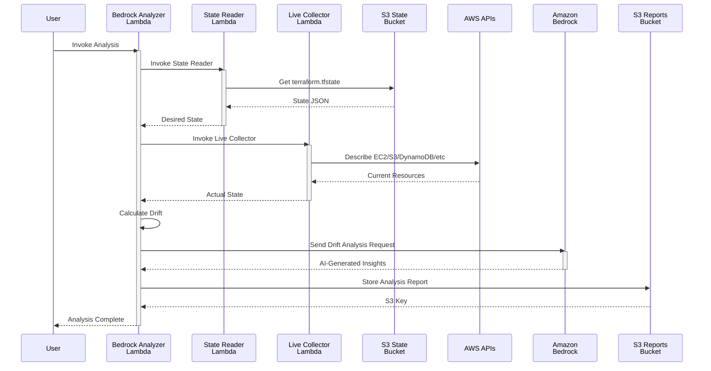
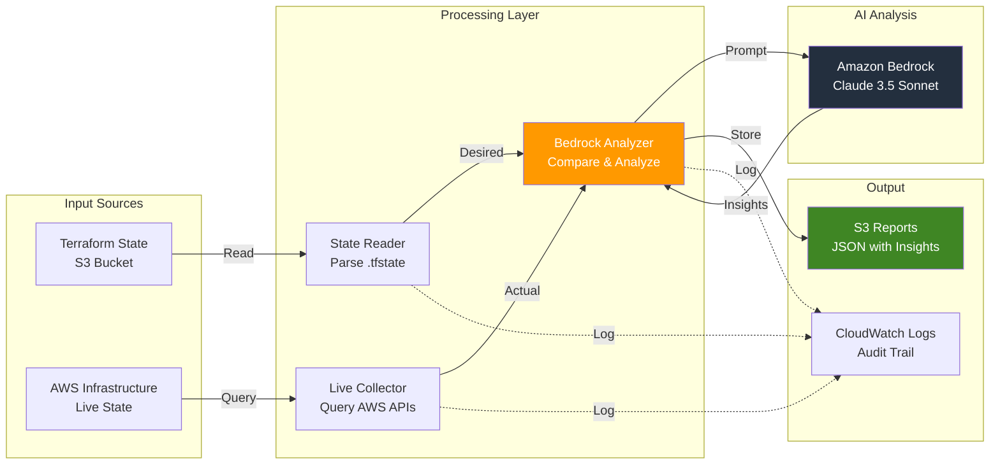
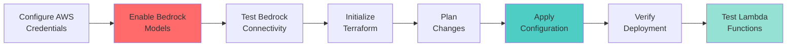

# AWS Infrastructure Drift Analyzer with Amazon Bedrock

[](https://www.terraform.io/)
[](https://aws.amazon.com/lambda/)
[](https://www.python.org/)
[](https://aws.amazon.com/bedrock/)

> An AI-powered serverless infrastructure analysis system that detects drift between Terraform state and actual AWS resources using Amazon Bedrock (Claude 3.5 Sonnet).

---

## Table of Contents

- [Overview](#overview)
- [Architecture](#architecture)
- [Features](#features)
- [Project Structure](#project-structure)
- [Prerequisites](#prerequisites)
- [Quick Start](#quick-start)
- [Deployment](#deployment)
- [Usage](#usage)
- [Configuration](#configuration)
- [Troubleshooting](#troubleshooting)
- [Cleanup](#cleanup)
- [Contributing](#contributing)

---

## Overview

The **Bedrock Lambda Terraform** project is an automated infrastructure analysis system that:

1. **Reads** Terraform state files from S3
2. **Collects** real-time AWS infrastructure status via Lambda
3. **Analyzes** infrastructure drift using Amazon Bedrock (Claude 3.5 Sonnet)
4. **Reports** findings in JSON format to S3 with AI-generated insights

### Key Benefits

- **AI-Powered Analysis**: Uses Claude 3.5 Sonnet for intelligent infrastructure insights
- **Drift Detection**: Identifies missing, extra, and misconfigured resources
- **Serverless**: No infrastructure to manage, pay only for what you use
- **Secure**: Fine-grained IAM policies with least privilege access
- **Automated Reporting**: Stores analysis reports in S3 with recommendations
- **Infrastructure as Code**: Deployed and managed entirely through Terraform

---

## Architecture

### System Architecture

```mermaid
graph TB
    subgraph "AWS Infrastructure"
        S3_State[S3 Bucket<br/>Terraform State<br/>scaler-terraform-backend]
        DDB[DynamoDB<br/>State Locks<br/>scaler-terraform-locks]
        
        subgraph "Lambda Functions"
            L1[Lambda 1<br/>State Reader<br/>512 MB / 60s]
            L2[Lambda 2<br/>Live Collector<br/>512 MB / 60s]
            L3[Lambda 3<br/>Bedrock Analyzer<br/>1024 MB / 120s]
        end
        
        subgraph "AWS Services"
            AWS_EC2[EC2 Instances]
            AWS_S3[S3 Buckets]
            AWS_DDB[DynamoDB Tables]
            AWS_Lambda[Lambda Functions]
            AWS_VPC[VPCs]
            AWS_EB[EventBridge Rules]
        end
        
        Bedrock[Amazon Bedrock<br/>Claude 3.5 Sonnet]
        S3_Reports[S3 Bucket<br/>Analysis Reports<br/>blp-development-bedrock-bucket]
        CW[CloudWatch Logs<br/>7 day retention]
    end
    
    S3_State -->|Read State| L1
    DDB -->|Check Locks| L1
    
    AWS_EC2 -->|Describe| L2
    AWS_S3 -->|List| L2
    AWS_DDB -->|Describe| L2
    AWS_Lambda -->|List| L2
    AWS_VPC -->|Describe| L2
    AWS_EB -->|List| L2
    
    L1 -->|Desired State| L3
    L2 -->|Actual State| L3
    L3 -->|Analysis Request| Bedrock
    Bedrock -->|AI Insights| L3
    L3 -->|Store Report| S3_Reports
    
    L1 -.->|Logs| CW
    L2 -.->|Logs| CW
    L3 -.->|Logs| CW
    
    style L3 fill:#FF9900
    style Bedrock fill:#232F3E
    style S3_Reports fill:#3F8624
```



### Data Flow Sequence



### Component Interaction



---

## Features

### Core Capabilities

- **Multi-Resource Analysis**: Monitors EC2, S3, DynamoDB, Lambda, VPCs, and EventBridge
- **Real-Time Drift Detection**: Compares Terraform state with actual AWS resources
- **AI-Powered Insights**: Uses Claude 3.5 Sonnet for intelligent recommendations
- **Comprehensive Reports**: Generates detailed JSON reports with severity levels
- **Security First**: Fine-grained IAM policies per Lambda function
- **Audit Trail**: CloudWatch Logs with 7-day retention
- **State Lock Detection**: Monitors DynamoDB for Terraform lock status
- **Cost Impact Analysis**: AI identifies potential cost implications of drift

### Supported Resource Types

| Resource Type | State Reader | Live Collector | Analysis |
|--------------|--------------|----------------|----------|
| EC2 Instances | ✅ | ✅ | ✅ |
| DynamoDB Tables | ✅ | ✅ | ✅ |
| S3 Buckets | ✅ | ✅ | ✅ |
| Lambda Functions | ✅ | ✅ | ✅ |
| VPCs | ✅ | ✅ | ✅ |
| EventBridge Rules | ✅ | ✅ | ✅ |

---

## Project Structure

```
bedrock_lambda_terraform/
├── Terraform Configuration (471 lines)
│   ├── backend.hcl              # Remote state config
│   ├── iam.tf                   # IAM roles and policies (236 lines)
│   ├── lambdas.tf               # Lambda definitions (110 lines)
│   ├── local.tf                 # Local values (50 lines)
│   ├── provider.tf              # AWS provider config
│   ├── s3.tf                    # S3 bucket for reports
│   ├── variables.tf             # Input variables (45 lines)
│   └── versions.tf              # Version constraints (30 lines)
│
├── Python Lambda Functions (340 lines)
│   └── lambdas/
│       ├── analyzer/
│       │   ├── lambda_bedrock_analyzer.py     # 195 lines
│       │   └── requirements.txt
│       ├── collector/
│       │   ├── lambda_functions_live_collector.py  # 70 lines
│       │   └── requirements.txt
│       └── lambda_state/
│           ├── lambda_state_reader.py         # 75 lines
│           └── requirements.txt
│
├── Configuration
│   ├── requirements.txt         # Python dependencies
│   ├── pyproject.toml           # Python project config
│   └── test_bedrock.py          # Bedrock connectivity test
│
└── Documentation
    ├── README.md                # This file
    ├── PROJECT_DOCUMENTATION.md # Detailed documentation
    └── plan.md                  # Deployment plan
```

### Code Statistics

- **Total Terraform Code**: 471 lines across 7 `.tf` files
- **Total Python Code**: 340 lines across 3 Lambda functions
- **AWS Resources Created**: 10+ resources (3 Lambdas, 3 IAM roles, 3 log groups, S3 bucket)
- **IAM Policies**: 4 custom policies + 1 standard role attachment

---

## Prerequisites

### Required Tools

| Tool | Version | Purpose |
|------|---------|---------|
| Terraform | ≥ 1.14.0 | Infrastructure provisioning |
| AWS CLI | ≥ 2.0 | AWS API access |
| Python | ≥ 3.9 | Lambda runtime |
| Git | Any | Version control |

### AWS Account Requirements

1. **AWS Account** with AdministratorAccess or equivalent permissions
2. **S3 Bucket** for Terraform state backend (`scaler-terraform-backend`)
3. **DynamoDB Table** for state locking (`scaler-terraform-locks`)
4. **Amazon Bedrock Access** with Claude 3.5 Sonnet enabled

### IAM Permissions Required

```json
{
  "Version": "2012-10-17",
  "Statement": [
    {
      "Effect": "Allow",
      "Action": [
        "lambda:*",
        "iam:*",
        "s3:*",
        "dynamodb:*",
        "logs:*",
        "bedrock:InvokeModel",
        "bedrock:ListFoundationModels",
        "ec2:Describe*",
        "rds:Describe*",
        "autoscaling:Describe*",
        "events:List*"
      ],
      "Resource": "*"
    }
  ]
}
```

### Installation

#### macOS
```bash
brew install terraform awscli python@3.11
```

#### Linux
```bash
# Terraform
wget https://releases.hashicorp.com/terraform/1.14.0/terraform_1.14.0_linux_amd64.zip
unzip terraform_1.14.0_linux_amd64.zip
sudo mv terraform /usr/local/bin/

# AWS CLI
curl "https://awscli.amazonaws.com/awscli-exe-linux-x86_64.zip" -o "awscliv2.zip"
unzip awscliv2.zip
sudo ./aws/install
```

---

## Quick Start

### Step 1: Configure AWS Credentials

```bash
# Configure AWS SSO
aws configure sso

# Login
aws sso login --profile AdministratorAccess-488519936220

# Verify credentials
aws sts get-caller-identity
```

### Step 2: Enable Amazon Bedrock Models (CRITICAL)

1. Navigate to **Amazon Bedrock** in AWS Console
2. Click **Model access** → **Manage model access**
3. Enable: **Anthropic Claude 3.5 Sonnet**
4. Click **Save changes**
5. Wait for "Access granted" status (~1-5 minutes)

### Step 3: Test Bedrock Connectivity

```bash
cd bedrock_lambda_terraform
python3 test_bedrock.py
```

Expected output:
```
[SUCCESS] Bedrock working!
[JSON analysis output]
```

### Step 4: Initialize Terraform

```bash
# Initialize with backend
terraform init -backend-config=backend.hcl

# Validate configuration
terraform validate

# Preview changes
terraform plan -out=tfplan
```

### Step 5: Deploy Infrastructure

```bash
# Apply Terraform configuration
terraform apply tfplan

# Expected: 10-12 resources created
```

---

## Deployment

### Deployment Process



### Detailed Deployment Steps

#### 1. Pre-Deployment Checks

```bash
# Verify prerequisites
terraform version    # Should show ≥ 1.14.0
aws --version       # Should show ≥ 2.0
python3 --version   # Should show ≥ 3.9

# Check AWS credentials
aws sts get-caller-identity --profile AdministratorAccess-488519936220

# Verify backend infrastructure
aws s3 ls | grep scaler-terraform-backend
aws dynamodb list-tables | grep scaler-terraform-locks
```

#### 2. Initialize Terraform

```bash
cd bedrock_lambda_terraform

# Initialize with backend configuration
terraform init -backend-config=backend.hcl

# Expected output:
# Initializing the backend...
# Successfully configured the backend "s3"!
```

#### 3. Review Terraform Plan

```bash
# Generate execution plan
terraform plan -out=tfplan

# Review resources to be created:
# - 3 Lambda functions
# - 3 IAM roles
# - 5 IAM policies
# - 3 CloudWatch log groups
# - 1 S3 bucket (with versioning, encryption)
```

#### 4. Deploy Infrastructure

```bash
# Apply the plan
terraform apply tfplan

# Deployment time: ~5-10 minutes
```

#### 5. Verify Deployment

```bash
# Check Lambda functions
aws lambda list-functions --region us-west-2 \
  --query 'Functions[?starts_with(FunctionName, `blp-development`)].FunctionName'

# Expected output:
# [
#   "blp-development-state-reader",
#   "blp-development-live-collector",
#   "blp-development-bedrock-analyzer"
# ]

# Check S3 bucket
aws s3 ls | grep blp-development-bedrock-bucket

# Check CloudWatch log groups
aws logs describe-log-groups --log-group-name-prefix /aws/lambda/blp-development
```

---

## Usage

### Manual Invocation

#### Test State Reader Lambda

```bash
aws lambda invoke \
  --function-name blp-development-state-reader \
  --region us-west-2 \
  --profile AdministratorAccess-488519936220 \
  /tmp/state_reader_output.json

cat /tmp/state_reader_output.json | jq '.desired_state.summary'
```

Expected output:
```json
{
  "ec2_count": 5,
  "dynamodb_count": 2,
  "s3_count": 3,
  "lambda_count": 4,
  "vpc_count": 1,
  "eventbridge_count": 2
}
```

#### Test Live Collector Lambda

```bash
aws lambda invoke \
  --function-name blp-development-live-collector \
  --region us-west-2 \
  --profile AdministratorAccess-488519936220 \
  /tmp/collector_output.json

cat /tmp/collector_output.json | jq '.actual_state.summary'
```

#### Run Full Analysis

```bash
aws lambda invoke \
  --function-name blp-development-bedrock-analyzer \
  --region us-west-2 \
  --profile AdministratorAccess-488519936220 \
  /tmp/analyzer_output.json

cat /tmp/analyzer_output.json | jq '.'
```

Expected output:
```json
{
  "statusCode": 200,
  "message": "Drift analysis completed",
  "report_key": "s3://blp-development-bedrock-bucket/reports/20260219_143052_drift.json"
}
```

### View Analysis Reports

```bash
# List all reports
aws s3 ls s3://blp-development-bedrock-bucket/reports/ \
  --recursive \
  --region us-west-2

# Download latest report
aws s3 cp s3://blp-development-bedrock-bucket/reports/20260219_143052_drift.json \
  /tmp/latest_report.json

# View report
cat /tmp/latest_report.json | jq '.'
```

### Sample Analysis Report

```json
{
  "timestamp": "2026-02-19T14:30:52.123456Z",
  "desired_summary": {
    "ec2_count": 5,
    "dynamodb_count": 2,
    "s3_count": 3,
    "lambda_count": 4,
    "vpc_count": 1,
    "eventbridge_count": 2
  },
  "actual_summary": {
    "ec2_count": 4,
    "dynamodb_count": 2,
    "s3_count": 3,
    "lambda_count": 4,
    "vpc_count": 1,
    "eventbridge_count": 2
  },
  "drift": {
    "has_drift": true,
    "resource_drifts": {
      "EC2": {
        "desired": 5,
        "actual": 4,
        "difference": -1
      }
    }
  },
  "bedrock_analysis": {
    "drift_severity": "Medium",
    "drift_explanation": "1 EC2 instance missing from desired state. This could indicate manual termination or failed deployment.",
    "lock_health": "Healthy",
    "availability_risk": "Medium - Missing EC2 instance may impact availability",
    "cost_impact": "Low - 1 instance savings, but may affect application functionality",
    "recommended_actions": [
      "Investigate why EC2 instance was terminated",
      "Update Terraform state if intentional",
      "Re-apply Terraform to restore missing instance"
    ],
    "summary": "Infrastructure drift detected. Immediate investigation recommended."
  },
  "s3_key": "s3://blp-development-bedrock-bucket/reports/20260219_143052_drift.json"
}
```

### CloudWatch Logs

```bash
# Tail logs in real-time
aws logs tail /aws/lambda/blp-development-bedrock-analyzer \
  --follow \
  --region us-west-2

# Query logs for errors
aws logs filter-log-events \
  --log-group-name /aws/lambda/blp-development-bedrock-analyzer \
  --filter-pattern "ERROR" \
  --region us-west-2
```

---

## Configuration

### Environment Variables

#### State Reader Lambda
```bash
TF_STATE_BUCKET=scaler-terraform-backend
TF_LOCK_TABLE=scaler-terraform-locks
```

#### Live Collector Lambda
```bash
# No environment variables required
# Uses Lambda execution role for AWS API access
```

#### Bedrock Analyzer Lambda
```bash
TF_STATE_LAMBDA_NAME=blp-development-state-reader
LIVE_COLLECTOR_LAMBDA_NAME=blp-development-live-collector
BEDROCK_MODEL_ID=anthropic.claude-3-5-sonnet-20240620-v1:0
RESULTS_BUCKET=blp-development-bedrock-bucket
TF_LOCK_TABLE=scaler-terraform-locks
```

### Terraform Variables

Edit `terraform.tfvars` to customize:

```hcl
region                = "us-west-2"
project_name          = "Bedrock-Lambda-Project"
environment           = "development"
namespace             = "bedrock"
short_name            = "blp"
s3_bucket_name        = "blp-development-bedrock-bucket"
tf_state_bucket       = "scaler-terraform-backend"
dynamodb_table_name   = "scaler-terraform-locks"
bedrock_model_id      = "anthropic.claude-3-5-sonnet-20240620-v1:0"
log_retention_days    = 7
```

### Lambda Configuration

| Lambda | Memory | Timeout | Runtime |
|--------|--------|---------|---------|
| State Reader | 512 MB | 60s | Python 3.14 |
| Live Collector | 512 MB | 60s | Python 3.14 |
| Bedrock Analyzer | 1024 MB | 120s | Python 3.14 |

---

## Troubleshooting

### Common Issues

#### Issue: Terraform Init Fails

```bash
Error: error reading Backend configuration: failed to decode
```

**Solution:**
```bash
# Verify backend.hcl format
cat backend.hcl

# Manually specify backend config
terraform init -backend-config=backend.hcl -reconfigure
```

#### Issue: Lambda Invoke Fails - Access Denied

```bash
AccessDenied: User is not authorized to perform: lambda:InvokeFunction
```

**Solution:**
```bash
# Check AWS credentials
aws sts get-caller-identity

# Verify IAM permissions
aws iam get-role-policy \
  --role-name blp-development-bedrock-analyzer-role \
  --policy-name lambda-invoke-access
```

#### Issue: Bedrock Model Not Found

```bash
ValidationException: Could not validate the provided model identifier
```

**Solution:**
1. Go to AWS Console → Amazon Bedrock → Model access
2. Verify Claude 3.5 Sonnet is enabled
3. Wait for "Access granted" status
4. Test with: `python3 test_bedrock.py`

#### Issue: S3 Bucket Already Exists

```bash
Error: Error creating S3 bucket: BucketAlreadyExists
```

**Solution:**
```bash
# Import existing bucket
terraform import aws_s3_bucket.analyzer_results blp-development-bedrock-bucket

# Or use different bucket name in terraform.tfvars
```

#### Issue: Lambda Timeout

```bash
Task timed out after 60.00 seconds
```

**Solution:**
```hcl
# In lambdas.tf, increase timeout
resource "aws_lambda_function" "bedrock_analyzer" {
  timeout = 300  # 5 minutes
  # ...
}
```

### Debug Commands

```bash
# Check Lambda logs
aws logs tail /aws/lambda/blp-development-bedrock-analyzer \
  --follow \
  --region us-west-2

# Get Lambda configuration
aws lambda get-function-configuration \
  --function-name blp-development-bedrock-analyzer \
  --region us-west-2

# Test IAM permissions
aws iam simulate-principal-policy \
  --policy-source-arn arn:aws:iam::488519936220:role/blp-development-bedrock-analyzer-role \
  --action-names bedrock:InvokeModel

# List Bedrock models
aws bedrock list-foundation-models --region us-west-2
```

---

## Cleanup

### Destroy All Resources

```bash
# Remove all infrastructure
terraform destroy -auto-approve

# Verify destruction
aws lambda list-functions --region us-west-2 \
  --query 'Functions[?starts_with(FunctionName, `blp-development`)].FunctionName'

# Check S3 bucket (should be empty/deleted)
aws s3 ls | grep blp-development
```

### Manual Cleanup (if Terraform fails)

```bash
# Delete Lambda functions
aws lambda delete-function --function-name blp-development-state-reader --region us-west-2
aws lambda delete-function --function-name blp-development-live-collector --region us-west-2
aws lambda delete-function --function-name blp-development-bedrock-analyzer --region us-west-2

# Delete S3 bucket
aws s3 rm s3://blp-development-bedrock-bucket --recursive
aws s3 rb s3://blp-development-bedrock-bucket --force

# Delete IAM roles (after detaching policies)
aws iam delete-role-policy \
  --role-name blp-development-bedrock-analyzer-role \
  --policy-name lambda-invoke-access

aws iam delete-role \
  --role-name blp-development-bedrock-analyzer-role

# Delete CloudWatch log groups
aws logs delete-log-group --log-group-name /aws/lambda/blp-development-state-reader
aws logs delete-log-group --log-group-name /aws/lambda/blp-development-live-collector
aws logs delete-log-group --log-group-name /aws/lambda/blp-development-bedrock-analyzer
```

---

## Cost Estimation

### Monthly Cost Breakdown (Estimated)

| Service | Usage | Cost |
|---------|-------|------|
| Lambda (State Reader) | 100 invocations/month × 60s | ~$0.01 |
| Lambda (Live Collector) | 100 invocations/month × 60s | ~$0.01 |
| Lambda (Bedrock Analyzer) | 100 invocations/month × 120s | ~$0.02 |
| Bedrock (Claude 3.5 Sonnet) | 100 invocations × 1500 tokens | ~$1.50 |
| S3 Storage | 100 reports × 10KB | ~$0.01 |
| CloudWatch Logs | 7-day retention | ~$0.50 |
| **Total Estimated** | | **~$2.05/month** |

*Based on 100 analyses per month with average token usage*

---

## Contributing

### Development Workflow

1. **Fork the repository**
2. **Create a feature branch**: `git checkout -b feature/amazing-feature`
3. **Make changes** and test locally
4. **Commit changes**: `git commit -m 'Add amazing feature'`
5. **Push to branch**: `git push origin feature/amazing-feature`
6. **Open a Pull Request**

### Testing

```bash
# Validate Terraform configuration
terraform validate
terraform fmt -check

# Test Python syntax
python3 -m py_compile lambdas/analyzer/lambda_bedrock_analyzer.py
python3 -m py_compile lambdas/collector/lambda_functions_live_collector.py
python3 -m py_compile lambdas/lambda_state/lambda_state_reader.py

# Test Bedrock connectivity
python3 test_bedrock.py
```

---

## License

This project is provided as-is for educational and demonstration purposes.

---

## Acknowledgments

- **Amazon Bedrock** for providing enterprise-grade AI models
- **Terraform** for infrastructure as code capabilities
- **AWS Lambda** for serverless compute
- **Claude 3.5 Sonnet** by Anthropic for intelligent analysis

---

## Support

For issues, questions, or contributions:

1. Check the [Troubleshooting](#-troubleshooting) section
2. Review [PROJECT_DOCUMENTATION.md](PROJECT_DOCUMENTATION.md) for detailed information
3. Open an issue in the repository

---

## Additional Resources

- [Terraform AWS Provider Documentation](https://registry.terraform.io/providers/hashicorp/aws/latest/docs)
- [AWS Lambda Developer Guide](https://docs.aws.amazon.com/lambda/latest/dg/welcome.html)
- [Amazon Bedrock Documentation](https://docs.aws.amazon.com/bedrock/)
- [Claude 3.5 Sonnet Model Card](https://www.anthropic.com/claude)

---

<div align="center">

**Built with Terraform, Python, and Amazon Bedrock**

[](https://www.terraform.io/)
[](https://aws.amazon.com/lambda/)
[](https://www.python.org/)

</div>
